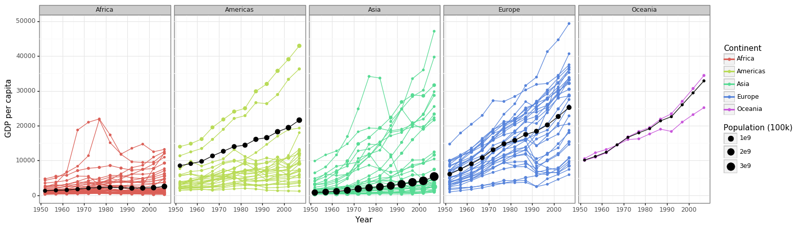
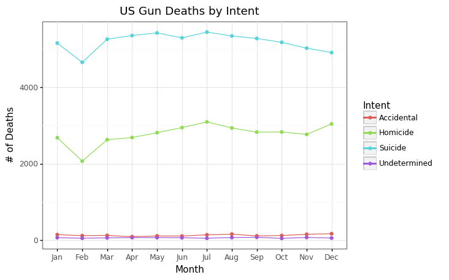
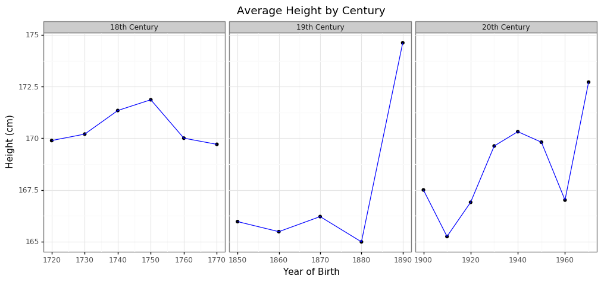
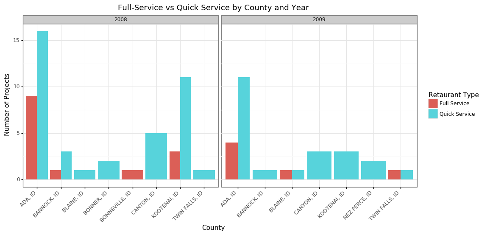
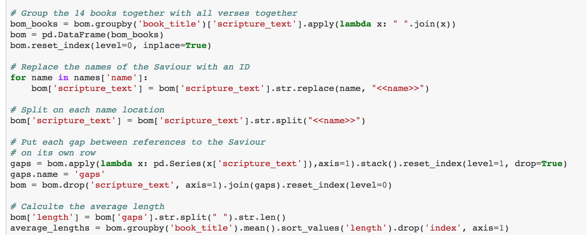
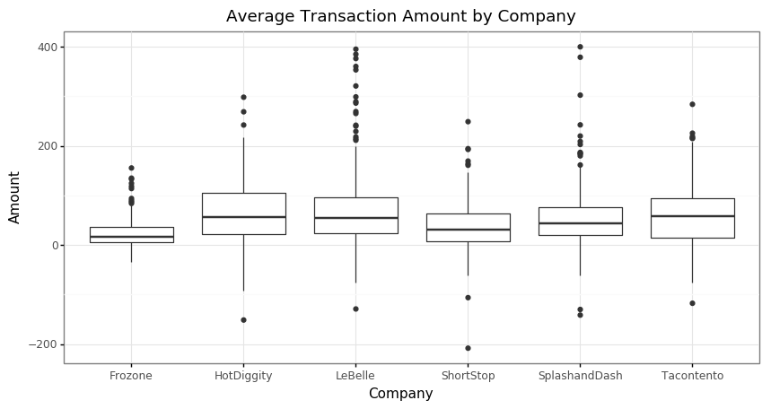
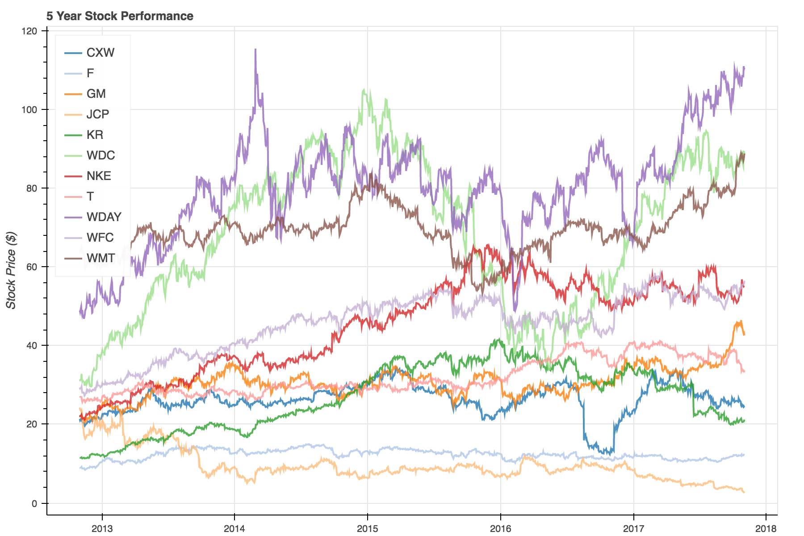
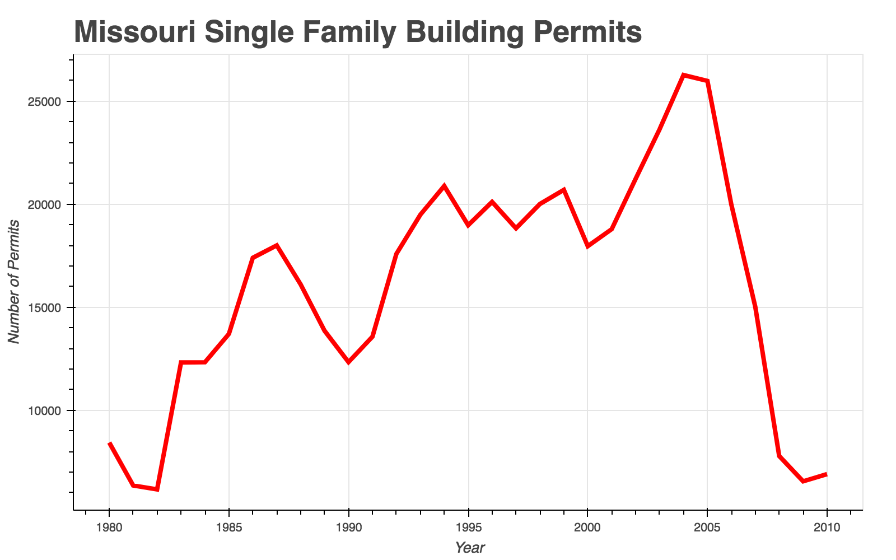
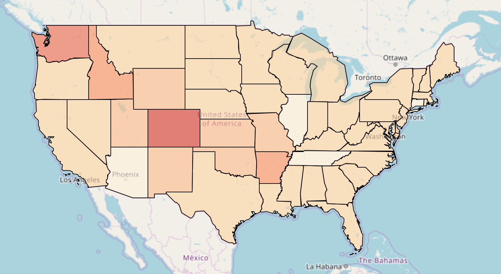

Data Wrangling for Beginners
============================
Welcome to my data wrangling repository. Currently, this repository contains work that I did in the Fall of 2017 for MATH 335: Data Wrangling and Visualization. These are some of my first attempts at data science. Therefore, you will notice that some projects are more polished than others. Here you will find links to the project themselves, as well as some thoughts on my experience creating them. 

## The Projects

<table>
  <tr>
    <td><h3><a href="https://nbviewer.jupyter.org/github/cjense77/data_wrangling/blob/master/Wealth%20and%20Life%20Expectancy/cs02.ipynb">Wealth and Life Expectancy</a></h3></td>
    <td><h3><a href="https://nbviewer.jupyter.org/github/cjense77/data_wrangling/blob/master/Reducing%20Gun%20Deaths/cs03.ipynb">Reducing Gun Deaths</a></h3></td>
    <td><h3><a href="https://nbviewer.jupyter.org/github/cjense77/data_wrangling/blob/master/Average%20Human%20Height/cs04.ipynb">Average Human Height</a></h3></td>
  </tr>
  <tr>
    <td></td>
    <td></td> 
    <td></td>
  </tr>
  <tr>
      <td><h3><a href="https://nbviewer.jupyter.org/github/cjense77/data_wrangling/blob/master/Construction%20in%20Idaho/cs05.ipynb">Construction in Idaho</a></h3></td>
    <td><h3><a href="https://nbviewer.jupyter.org/github/cjense77/data_wrangling/blob/master/Counting%20Names%20in%20Scripture/cs06.ipynb">Counting Names in Scripture</a></h3></td> 
    <td><h3><a href="https://nbviewer.jupyter.org/github/cjense77/data_wrangling/blob/master/Business%20Transactions/cs07.ipynb">Business Transaction</a></h3></td>
  </tr>
  <tr>
    <td></td>
    <td></td>
    <td></td>
  </tr>
  <tr>
      <td><h3><a href="https://nbviewer.jupyter.org/github/cjense77/data_wrangling/blob/master/Stock%20Performance%20Timeseries/cs08.ipynb">Stock Performance Timeseries</a></h3></td>
    <td><h3><a href="https://nbviewer.jupyter.org/github/cjense77/data_wrangling/blob/master/Mortgage%20Crisis%201/cs10%20v2.ipynb">Mortgage Crisis 1</a></h3></td> 
    <td><h3><a href="https://nbviewer.jupyter.org/github/cjense77/data_wrangling/blob/master/Mortgage%20Crisis%202/cs11.ipynb">Mortgage Crisis 2</a></h3></td>
  </tr>
  <tr>
    <td></td>
    <td></td>
    <td></td>
  </tr>
</table>

## Some Thoughts On R and Python

The main platform for the analysis of the class was R, but being fully indoctrinated into Python, I decided that I would march to the beat of my own drum. This gave me a unique opportunity throughout the semester to compare R and Python side-by-side. For context, most the analysis I did in R was using Hadley Wickham's tidyverse, and most of the analyss I did in Python was using Pandas. After using both tools, here's my take on the R vs. Python discussion.

In terms of performing data analysis, R is like a fancy restaurant. At a restaurant, you tend to end up with something delicious because the chef is likely to only put items on the menu that she cooks well. In this way, R excels. Especially when paired with a powerful IDE like [RStudio](https://www.rstudio.com/) and a few choice packages such as Hadley Wickham's [tidyverse](https://www.tidyverse.org/), R provides a robust and user-friendly platform for data analysis. However, a programmer coming into R from a more comphresensive language will likely find themselves frustrated by the inflexibility of the base R language. Continuing with our restaurant analogy, say you wanted your salmon filet pan-fried instead of steamed. If it's not on the menu, you're probably out of luck. Similarly, becuase R was created with statistics and data science in mind, it is sometimes quite cumbersome to implement a program not related to those fields. 

Python, on the other hand, is like your own kitchen at home. The quality of the food depends primarily on the skill of the chef. A professional can produce something delicious and completely customized. A novice, however, is likely to produce a disaster on his first few attempts. Python wasn't originally built for doing data analysis. That fact is evidenced by the relative immaturity of data science and visualization packages such as [Pandas](https://pandas.pydata.org/), [Agate](https://agate.readthedocs.io/en/1.6.0/), [Bokeh](https://bokeh.pydata.org/en/latest/), and [pygal](http://pygal.org/en/stable/). While they are certainly powerful and quickly improving, they lack the simplicity and user-friendliness of their R equivalents. In the hands of a professional, wonderful and delicious things can be accomplished, but newbies to the field need to be prepared for a steep learning curve. 

## An Example

Let me show you what I mean. Below I will show a basic data manipulation in Python and in R. In the example here, we have a data frame with a column called 'Project Title', which contains the name of a construction project. We are trying to create another column that, depending on the value in 'Project Title', will apply one of four labels: 'Not Restuarant', 'Standalone Retail', 'Full Service', and 'Quick Service'. 

#### Python via Pandas
```
buildings['ProjectTitle'].apply(lambda x: 'Not Restaurant' if any(word in x for word in not_restaurants) 
                                  else 'Standalone Retail' if any(word in x for word in standalone_retail) 
                                  else 'Full Service'      if any(word in x for word in full_service_type) 
                                  else 'Quick Service'     if any(word in x for word in quick_service_type) 
                                  else 'NA')
```

#### R via dplyr
```
mutate(build_type = case_when(
      str_detect(ProjectTitle, paste(not_restaurants, collapse = "|")) ~ "Not Restaurant",
      str_detect(ProjectTitle, paste(standalone_retail, collapse = "|")) ~ "Standalone Retail",
      str_detect(ProjectTitle, paste(full_service, collapse = "|")) ~ "Full Service",
      str_detect(ProjectTitle, paste(quick, collapse = "|"))) ~ "Quick Service"
    ))
```

At first, these two blocks of code seem very comparable. They are both technically just a single line of code with new lines added for readability. They both have quirky bits of complexity. However, the real difference appears in the level of expertise needed to produce the ideas implemented here. The R code principally uses four functions: mutate, str_detect, case_when, and paste. These functions are all fundamental to data analysis with dplyr and will be used frequently enough by the beginning R programmer that their use is fairly intuitive. 

On the other hand, the Python code uses lambda functions, list comprehensions, and the boolean any, all of which are fairly sophisticated methods and wouldn't intuitively pop into the minds of beginning Python users. Which block of code is ultimately better is a subject questions falling to the opinion of the programmer, but R is probably better in terms of ease of learning for new data analysts. 
